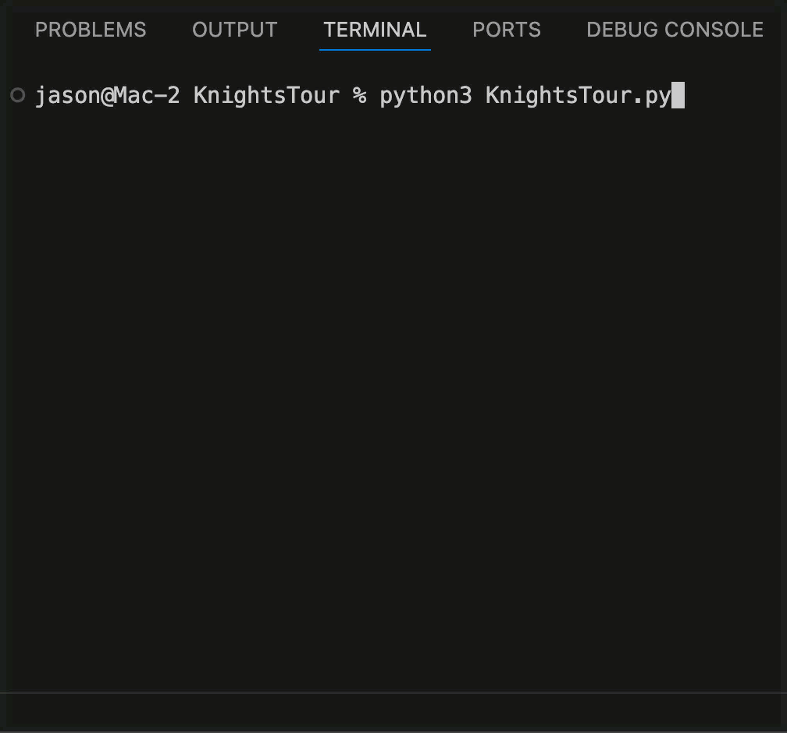

# ♟️ PuzzleSolvers – Knight's Tour & Beyond

A growing collection of classic algorithmic puzzles, reimagined with modern code and retro-inspired presentation.  
Starting with the **Knight's Tour**, solved and animated entirely in the terminal.

---

## ♞ Knight's Tour (ASCII Animation + Hybrid Solver)

This classic chess puzzle asks:  
*Can a knight visit every square on an 8×8 board exactly once?*

This Python solution includes:
- ✅ **Warnsdorff's Heuristic** for blazing-fast tour generation
- 🔁 **Recursive Backtracking Fallback** to guarantee success
- 🐴 **Terminal Animation** showing the knight hopping across the board
- 📐 **Board Validation** to confirm a correct solution
- 🔥 Optional edge case detection for rare heuristic failures

---

### 📸 Demo Preview




---

## 🧩 How to Use

### ▶️ Run the Knight's Tour

```bash
python3 KnightsTour.py
